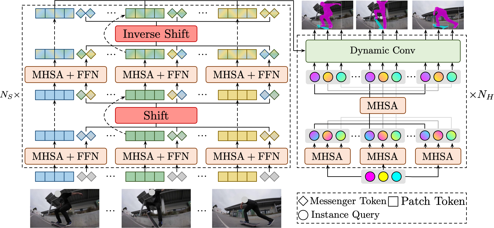
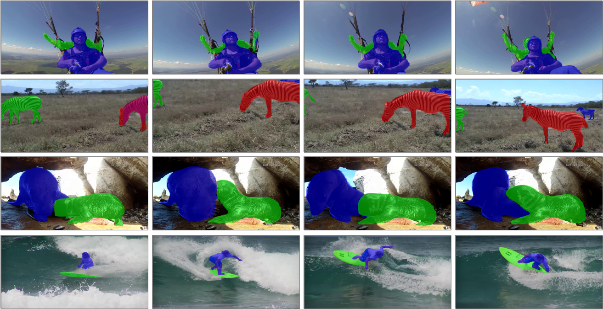

# Temporally Efficient Vision Transformer for Video Instance Segmentation

> [**Temporally Efficient Vision Transformer for Video Instance Segmentation**](https://arxiv.org/abs/2204.08412) (CVPR 2022, Oral)
>
> by [Shusheng Yang](https://bit.ly/shushengyang_googlescholar)<sup>1,3</sup>, [Xinggang Wang](https://xinggangw.info/)<sup>1 :email:</sup>, [Yu Li](https://yu-li.github.io/)<sup>4</sup>, [Yuxin Fang](https://bit.ly/YuxinFang_GoogleScholar)<sup>1</sup>, [Jiemin Fang](https://jaminfong.cn/)<sup>1,2</sup>, [Wenyu Liu](http://eic.hust.edu.cn/professor/liuwenyu/)<sup>1</sup>, [Xun Zhao](https://scholar.google.com.hk/citations?user=KF-uZFYAAAAJ)<sup>3</sup>, [Ying Shan](https://scholar.google.com/citations?user=4oXBp9UAAAAJ&hl=en)<sup>3</sup>.
> 
> <sup>1</sup> [School of EIC, HUST](http://eic.hust.edu.cn/English/Home.htm), <sup>2</sup> [AIA, HUST](http://english.aia.hust.edu.cn/), <sup>3</sup> [ARC Lab, Tencent PCG](https://arc.tencent.com/en/index), <sup>4</sup> [IDEA](https://idea.edu.cn/en).
>
> (<sup>:email:</sup>) corresponding author.
>


</br>

* This repo provides code, models and training/inference recipes for **TeViT**(Temporally Efficient Vision Transformer for Video Instance Segmentation).
* TeViT is a transformer-based end-to-end video instance segmentation framework. We build our framework upon the query-based instance segmentation methods, i.e., `QueryInst`.
* We propose a messenger shift mechanism in the transformer backbone, as well as a spatiotemporal query interaction head in the instance heads. These two designs fully utlizes both frame-level and instance-level temporal context information and obtains strong temporal modeling capacity with negligible extra computational cost.

</br>

<div align="center">
  
</div>

<!-- </br> -->

<!-- <div align="center">
  
</div> -->

<!-- </br> -->

## Models and Main Results

* We provide both checkpoints and codalab server submissions on `YouTube-VIS-2019` dataset.

Name | AP | AP@50 | AP@75 | AR@1 | AR@10 | model | submission
--- |:---:|:---:|:---:|:---:|:---:|:---:|:---:
[TeViT_MsgShifT](configs/tevit/tevit_msgshift.py) | 46.3 | 70.6 | 50.9 | 45.2 | 54.3 | [link](https://github.com/hustvl/Storage/releases/download/v1.1.0/tevit_msgshift.pth) | [link](https://github.com/hustvl/Storage/releases/download/v1.1.0/tevit_msgshift.zip)
[TeViT_MsgShifT_MST](configs/tevit/tevit_msgshift_mstrain.py) | 46.9 | 70.1 | 52.9 | 45.0 | 53.4 | [link](https://github.com/hustvl/Storage/releases/download/v1.1.0/tevit_msgshift_mstrain.pth) | [link](https://github.com/hustvl/Storage/releases/download/v1.1.0/tevit_msgshift_mstrain.zip)
* We have conducted multiple runs due to the training instability and checkpoints above are all the best one among multiple runs. The average performances are reported in our paper.
* Besides basic models, we also provide TeViT with `ResNet-50` and `Swin-L` backbone, models are also trained on `YouTube-VIS-2019` dataset.
* MST denotes multi-scale traning.

Name | AP | AP@50 | AP@75 | AR@1 | AR@10 | model | submission
--- |:---:|:---:|:---:|:---:|:---:|:---:|:---:
[TeViT_R50](configs/tevit/tevit_r50.py) | 42.1 | 67.8 | 44.8 | 41.3 | 49.9 | [link](https://github.com/hustvl/Storage/releases/download/v1.1.0/tevit_r50.pth) | [link](https://github.com/hustvl/Storage/releases/download/v1.1.0/tevit_r50.zip)
[TeViT_Swin-L_MST](configs/tevit/tevit_swin-l_mstrain.py) | 56.8 | 80.6 | 63.1 | 52.0 | 63.3 | [link](https://github.com/hustvl/Storage/releases/download/v1.1.0/tevit_swin-l_mstrain.pth) | [link](https://github.com/hustvl/Storage/releases/download/v1.1.0/tevit_swin-l_mstrain.zip)

* Due to backbone limitations, TeViT models with `ResNet-50` and `Swin-L` backbone are conducted with `STQI Head` only (i.e., without our proposed `messenger shift mechanism`).
* With `Swin-L` as backbone network, we apply more instance queries (i.e., from 100 to 300) and stronger data augmentation strategies. Both of them can further boost the final performance.

## Installation

### Prerequisites

* Linux
* Python 3.7+
* CUDA 10.2+
* GCC 5+

### Prepare

* Clone the repository locally:

```bash
git clone https://github.com/hustvl/TeViT.git
```

* Create a conda virtual environment and activate it:
```bash
conda create --name tevit python=3.7.7
conda activate tevit
```

* Install YTVOS Version API from [youtubevos/cocoapi](https://github.com/youtubevos/cocoapi):
```
pip install git+https://github.com/youtubevos/cocoapi.git#"egg=pycocotools&subdirectory=PythonAPI
```

* Install Python requirements
```
torch==1.9.0
torchvision==0.10.0
mmcv==1.4.8
pip install -r requirements.txt
```

* Please follow [Docs](https://mmdetection.readthedocs.io/en/v2.21.0/get_started.html) to install `MMDetection`
```bash
python setup.py develop
```

* Download ```YouTube-VIS 2019``` dataset from [here](https://youtube-vos.org/dataset/vis/), and organize dataset as follows:
```
TeViT
├── data
│   ├── youtubevis
│   │   ├── train
│   │   │   ├── 003234408d
│   │   │   ├── ...
│   │   ├── val
│   │   │   ├── ...
│   │   ├── annotations
│   │   │   ├── train.json
│   │   │   ├── valid.json
```

## Inference

```bash
python tools/test_vis.py configs/tevit/tevit_msgshift.py $PATH_TO_CHECKPOINT
```
After inference process, the predicted results is stored in ```results.json```, submit it to the [evaluation server](https://competitions.codalab.org/competitions/20128) to get the final performance.

## Training

* Download the COCO pretrained `QueryInst` with PVT-B1 backbone from [here](https://github.com/hustvl/Storage/releases/download/v1.1.0/queryinst_pvtv2-b1_fpn_mstrain_480-800_3x_coco.pth).
* Train TeViT with 8 GPUs:
```bash
./tools/dist_train.sh configs/tevit/tevit_msgshift.py 8 --no-validate --cfg-options load_from=$PATH_TO_PRETRAINED_WEIGHT
```
* Train TeViT with multi-scale data augmentation:
```bash
./tools/dist_train.sh configs/tevit/tevit_msgshift_mstrain.py 8 --no-validate --cfg-options load_from=$PATH_TO_PRETRAINED_WEIGHT
```
* The whole training process will cost about **three hours** with 8 TESLA V100 GPUs.
* To train TeViT with `ResNet-50` or `Swin-L` backbone, please download the COCO pretrained weights from [`QueryInst`](https://github.com/hustvl/QueryInst).

## Acknowledgement :heart:

This code is mainly based on [```mmdetection```](https://github.com/open-mmlab/mmdetection) and [```QueryInst```](https://github.com/hustvl/QueryInst), thanks for their awesome work and great contributions to the computer vision community!

## Citation

If you find our paper and code useful in your research, please consider giving a star :star: and citation :pencil: :

```BibTeX
@inproceedings{yang2022tevit,
  title={Temporally Efficient Vision Transformer for Video Instance Segmentation,
  author={Yang, Shusheng and Wang, Xinggang and Li, Yu and Fang, Yuxin and Fang, Jiemin and Liu and Zhao, Xun and Shan, Ying},
  booktitle =   {Proc. IEEE Conf. Computer Vision and Pattern Recognition (CVPR)},
  year      =   {2022}
}
```
